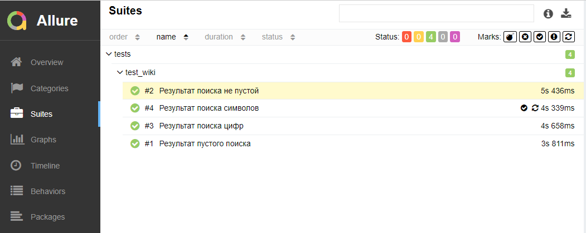
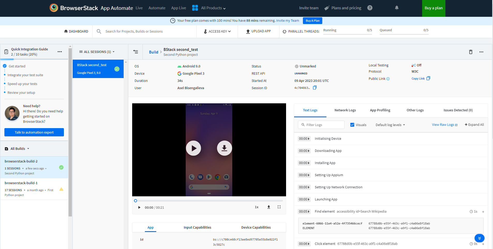
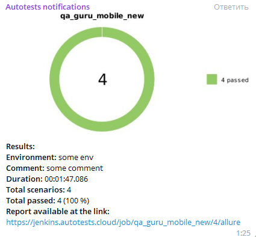

## Проект Mobile автотестов для приложения Wikipedia

<!-- Технологии -->

### Используемые технологии
<p  align="center">
  <code></code>
  <code></code>
  <code></code>
  <code></code>
  <code></code>
  <code></code>
  <code></code>
  <code></code>

</p>

### Что выполняет тест:



### Видео о прохождении одного из тестов


## :computer: Запуск тестов из терминала
```bash
env -S "context=browserstack" pytest .
env -S "context=emulation" pytest .
```

<!-- Jenkins -->

###  Запуск проекта в Jenkins

### [Job](https://jenkins.autotests.cloud/job/qa_guru_mobile_new/)

##### При нажатии на "Собрать сейчас" начнется сборка тестов и их прохождение


<!-- Browserstack -->

###  Запуск проекта в [Browserstack](https://app-automate.browserstack.com/dashboard/v2/builds/3f67a07716e00de80faea53fa149a79d79b02ff6/sessions/4c7048636db735420b8d18f6207b4c34f773fd8e)
##### Где в реальном времени можно следить за прохождением теста через логи.




<!-- Telegram -->

###  Telegram

##### Настроен телеграм-бот, после прохождения тестов в Jenkins присылает уведомление с отчетом в Телеграм

##### Скриншот отчета в телеграм


